# 쳌책 - 중고책 상태 및 가격 판별 서비스

| [Notion 바로가기](https://ambitious-cafe-d87.notion.site/STRAIGHT-179dd48db34c43999fe254dd18504c90?pvs=4) | [Figma 바로가기](https://www.figma.com/file/iPP1uHEsxyASr0WNVjTnoO/%EC%B3%8C%EC%B1%85?type=design&node-id=10%3A4&mode=design&t=ajAazfUhB2n5VW1m-1) |

 

## 기간

- 2023.8.28 ~ 2023.10.6 (6주)

 
 

## 기획 배경

- 환경 보호는 중요한 이슈이며, 많은 사람 및 기업들이 관심을 갖고 있음.
- 다른 물건은 중고로 많이 거래되지만, 책은 특성 상 중고로 거래를 잘 하지 않고 그냥 폐기 처분해버리는 경우가 많음.
- 사용자는 버리기 보다는 책의 가격을 측정할 수 있다면 중고로 판매하여 금전적 이득을 얻을 수 있고, 이는 단순히 버리는게 아닌 재활용이므로 환경에도 기여할 수 있음

  

## 메인 페이지

## 주요 기능

- 책 표지 이미지를 통한 상태 판별 및 중고가 예측

### 로그인

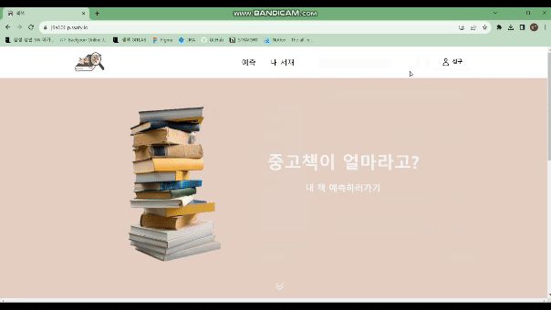

### 예측하기

### 히스토리

  

## 기술 스택

### FE

<table>
<th>분류</th>
<th style="text-align: center; font-size: 20px">Front-End</th>
<tr>
<td style="text-align: center;">언어</td>
<td>
    
    
    
</td>
</tr>
<tr>
<td style="text-align: center;">라이브러리</td>
<td>
    
    
    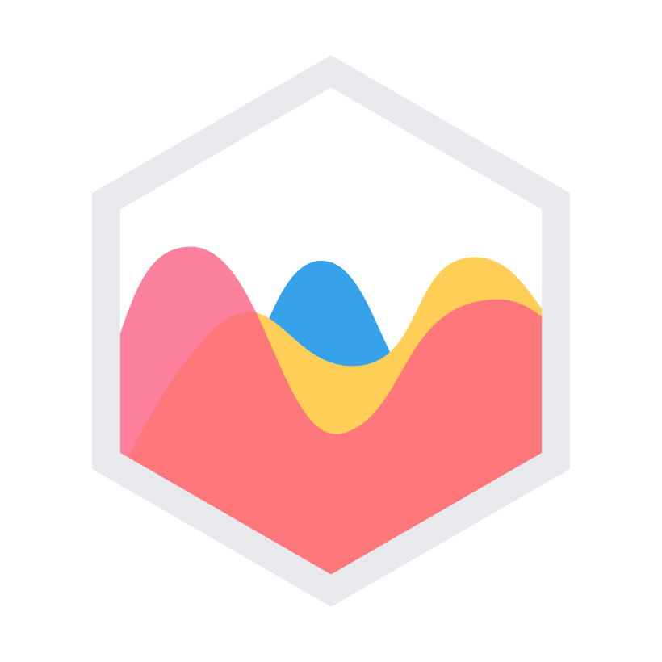
    
</td>
</table>

### BE

<table>
<th>분류</th>
<th style="text-align: center; font-size: 20px">Back-End</th>
<tr>
<td style="text-align: center;">언어</td>
<td>
    
    
</td>
</tr>
<tr>
<td style="text-align: center;">라이브러리</td>
<td>
    
    
</tr>
<tr>
<tr>
<td style="text-align: center;">프레임 워크</td>
<td>
    
    
    
    
</tr>
<tr>
<td style="text-align: center;">API</td>
<td>
    
    
</td>
</tr>
</table>

### INFRA

<table>
<th style="text-align: center; font-size: 15px">분류</th>
<th style="text-align: center; font-size: 20px">INFRA</th>
<tr>
<td style="text-align: center;">CI/CD</td>
<td>
    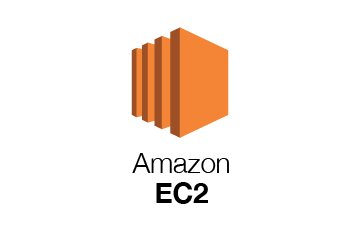
    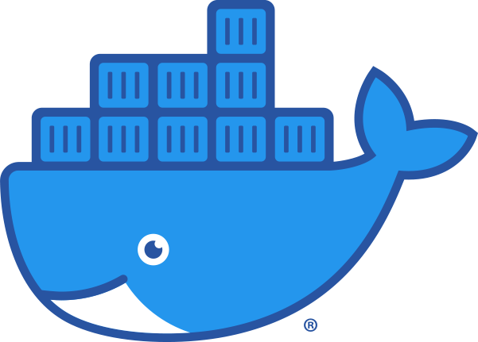
    
</td>
</tr>
<tr>
<td style="text-align: center;">Storage</td>
<td>
    
    
</td>
</tr>
</table>

### TOOLS

<table>
<th style="text-align: center; font-size: 20px">TOOLS</th>
<tr>
<td>
    
    
    
    
    
    
</td>
</tr>
</table>

  

## 서버 번호

<table style="text-align: center;">

<tr>
<td>서버</td>
<td>포트번호</td>
<td>서비스</td>
<td>비고</td>
</tr>
<tr>
<td>Client</td>
<td>3000</td>
<td>Front-End</td>
<td></td>
</tr>
<tr>
<td>Nginx</td>
<td>80, 443</td>
<td>WS, SSL</td>
<td></td>
</tr>
<tr>
<td>DB</td>
<td>3306</td>
<td>Maria DB</td>
<td></td>
</tr>
<tr>
<td>Auth</td>
<td>8081</td>
<td>인증, 인가</td>
<td></td>
</tr>
<tr>
<td>Business</td>
<td>8082</td>
<td>Front-Back 연동</td>
<td></td>
</tr>
<tr>
<td>TextAbstraction</td>
<td>8083</td>
<td>책 글자 추출</td>
<td></td>
</tr>
<tr>
<td>Search</td>
<td>8084</td>
<td>추출 글자로 책 정보 검색</td>
<td></td>
</tr>
<tr>
<td>StatusClassification</td>
<td>8085</td>
<td>책 상태 판별 AI</td>
<td></td>
</tr>
<tr>
<td>Analysis</td>
<td>8086</td>
<td>책 상태별 가격 산출</td>
<td></td>
</tr>
<tr>
<td>Jenkins</td>
<td>9090</td>
<td>자동 배포</td>
<td></td>
</tr>
<td>Redis</td>
<td>6379</td>
<td>Token 관리</td>
<td></td>
<tr>
</tr>
</table>

## Architecture

  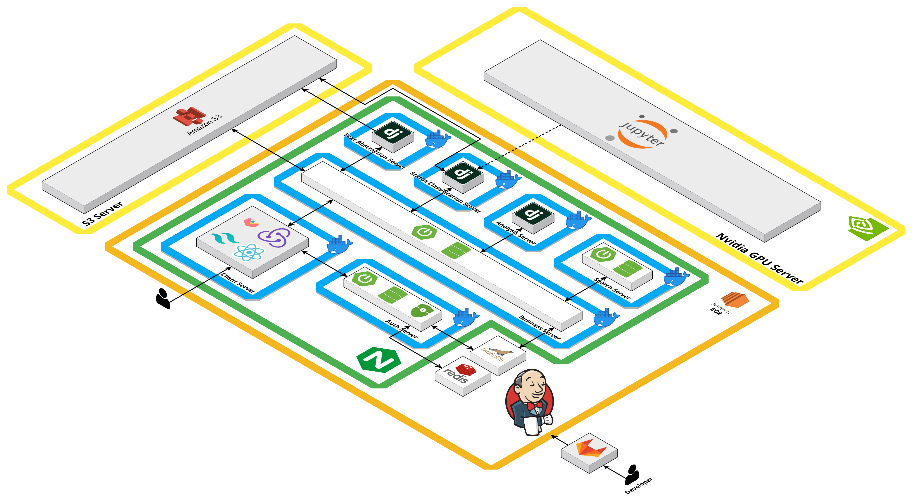

  

## Flow Chart

### 인증/인가

 

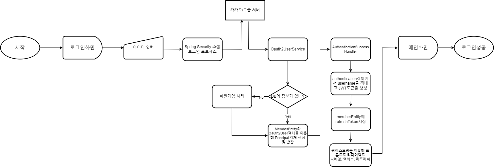
 
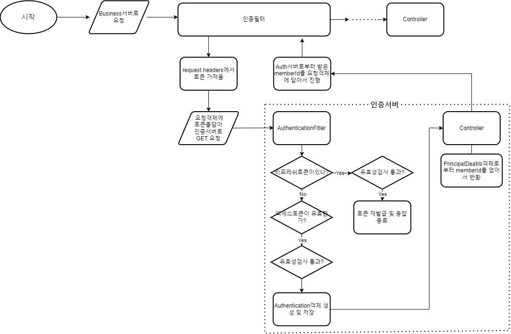

### Book Predict

 

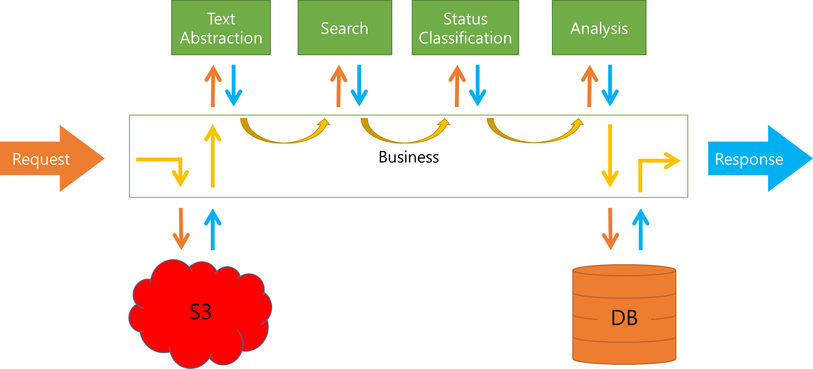

 

## ML Accuracy Chart

<h3 style="text-align: center;"> 최종 모델 Accuracy </h3>

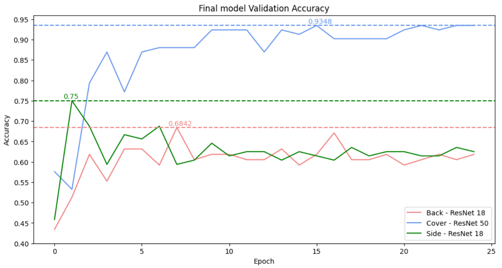

 
 

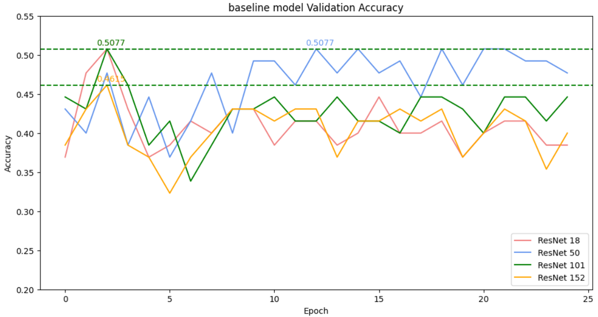

초기모델

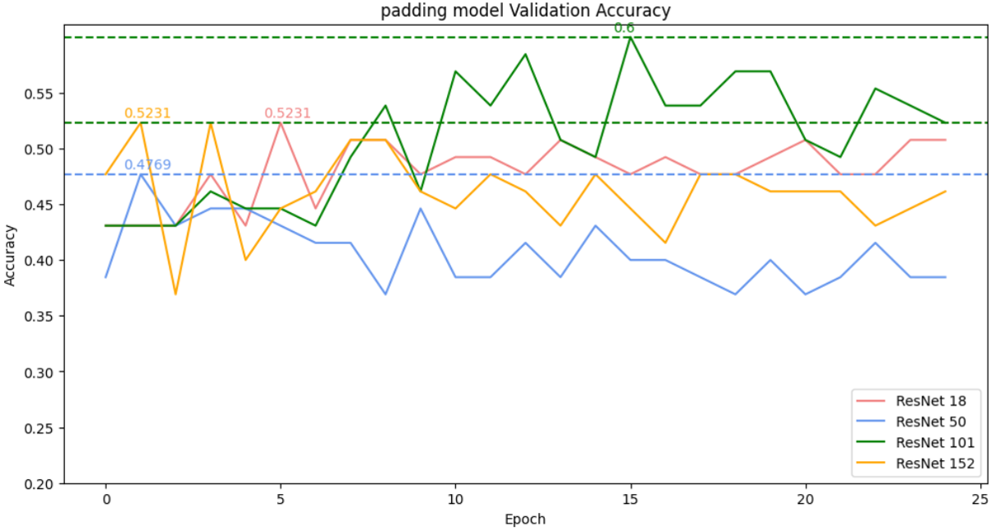

1차 개선모델

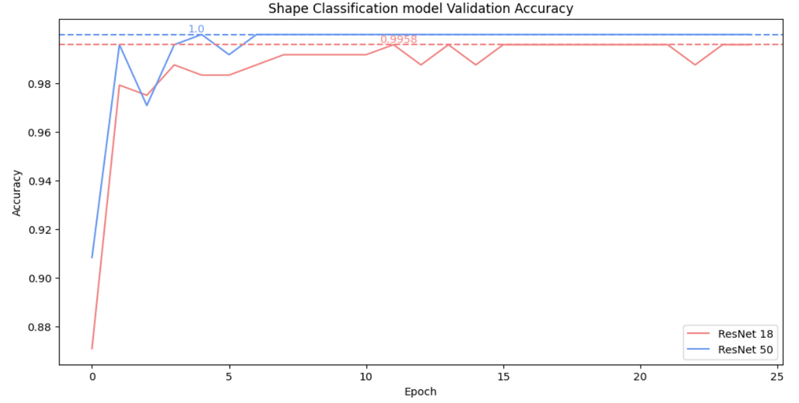

2차 개선모델

### 1차 개선 사항 - 이미지 패딩

- 낮은 정확도 개선을 위해 책의 전체 이미지를 학습할 수 있도록 개선
- 이미지의 가장자리 부분에 패딩 처리

 

### 2차 개선 사항 - 유형 분류

- 책 옆면, 앞면, 뒷면을 분류하는 모델 학습
- 1차적으로 책의 어떤 면인가를 분류하고, 그 다음 상태를 분류하도록 함

 
 
 

## 역할 분담

<table style="margin: 0 auto;">
<th colspan="6" style="text-align: center; font-size: 40px;">Team Straight</th>
<tr style="text-align: center;">
<td>허재(30)</td>
<td>김보석(29)</td>
<td>전재우(28)</td>
<td>이정석(27)</td>
<td>이승환(27)</td>
<td>강성구(26)</td>
</tr>
<tr >
<td></td>
<td></td>
<td></td>
<td></td>
<td></td>
<td></td>
</tr>
<tr style="text-align:center;">
<td>BE</td>
<td>팀장/FE</td>
<td>BE/CI/CD</td>
<td>CI/CD</td>
<td>BE/ML</td>
<td>FE/ML</td>
</tr>

</table>
